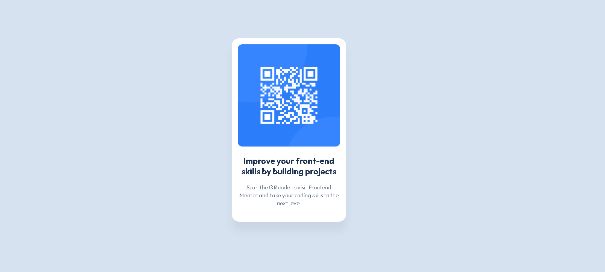

# Frontend Mentor - QR code component solution

This is a solution to the [QR code component challenge on Frontend Mentor](https://frontendmentor.io). Frontend Mentor challenges help you improve your coding skills by building realistic projects.

## Table of contents

- [Overview](#overview)
  - [The challenge](#the-challenge)
  - [General thoughts](#general-thoughts)
  - [Links](#links)
  - [My process](#my-process)
    - [Built with](#built-with)
    - [What I learned](#what-i-learned)
    - [Continued development](#continued-development)
- [Author](#author)

## Overview


### The challenge

Users should be able to:

- View the optimal layout for the component depending on their device's screen size.

### General thoughts

This was my very first challenge on Frontend Mentor, and it turned out to be an amazing starting point! While the layout looks simple at first glance, making it truly robust and adaptable taught me a lot about responsive design. It really helped me bridge the gap between just knowing CSS properties and actually applying them to build clean, real-world components.

### Links

- Solution URL: [View Solution](https://frontendmentor.io)
- Live Site URL: [View Live Site](https://jovermer-frontend.github.io/qr-code-component-main/)

## My process

### Built with

This project was built using a clean stack without any third-party libraries:

- Semantic HTML5 markup
- CSS custom properties (Variables)
- Flexbox for perfect centering
- Mobile-first workflow
- Responsive design (max-width, rem)

### What I learned

During my work on this challenge, I reinforced my fundamental skills in element positioning, typography, and clean code layout.

I learned how to use CSS variables for quick and efficient color palette management:

```css
:root { 
    --white-qr-card-article: hsl(0, 0%, 100%); 
    --slate-color-body-300: hsl(212, 45%, 89%); 
    --slate-fon-paragraph-500: hsl(216, 15%, 48%); 
    --slate-color-title-900: hsl(218, 44%, 22%); 
} 
```

I also mastered centering a component perfectly on the screen using Flexbox:

```css
.page-main { 
    display: flex; 
    justify-content: center; 
    align-items: center; 
    min-height: 100vh; 
} 
```

### Continued development

In future projects, I plan to focus on:
- Learning the two-dimensional CSS Grid layout.
- Deepening my knowledge of the BEM methodology for an even cleaner class structure.
- Adding interactivity using JavaScript.

## Author

- Frontend Mentor - [Matvey](https://www.frontendmentor.io/profile/matvejbezvodinskih642-create)
- GitHub - [jovermer-frontend](https://github.com/jovermer-frontend/qr-code-component-main)
